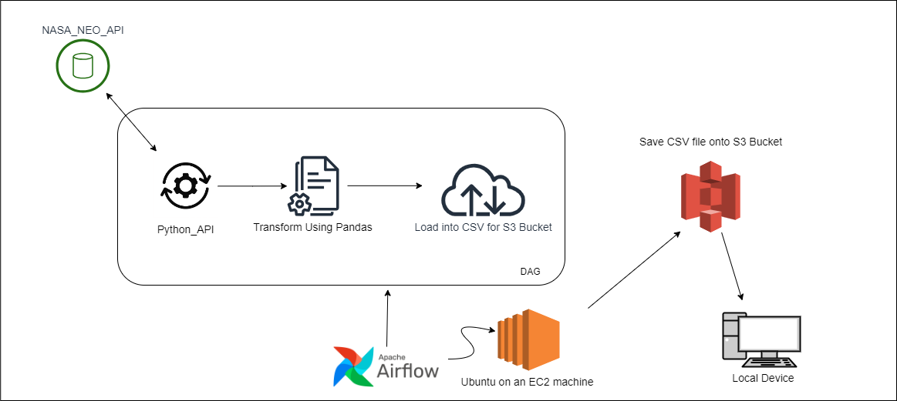
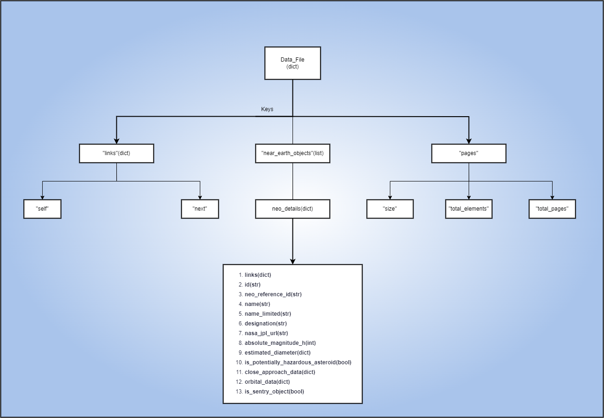

# NASA_NEO_ETL

## Overview  

This project implements an ETL (Extract, Transform, Load) pipeline that fetches data about near-Earth objects from the NASA Near-Earth Object (NEO) API. The data is transformed into a structured format using Pandas and loaded into an AWS S3 bucket as a CSV file for easy analytics. Apache Airflow is used for orchestration, allowing the pipeline to run on a scheduled basis.   

## Features  

- **Data Extraction**: Fetch near-Earth object data using the NASA NEO API.  
- **Data Transformation**: Convert API data into a Pandas DataFrame for analysis.  
- **Data Loading**: Upload the DataFrame to an AWS S3 bucket in CSV format.  
- **Automation**: Schedule and manage the ETL process with Apache Airflow.  

## Technology used  

Before running the ETL pipeline, ensure you have the following installed:  

- Scripting - Python 
- Libraries:  
  - Pandas (
  - S3FS (for AWS S3 interactions)  
  - Requests (to call the NASA API)  
  - Apache Airflow  
- AWS:
  - EC2 Instance
  - S3 Bucket  
- APIs: [NASA](https://api.nasa.gov/)
- Scheduler: Apache Airflow  

## Architecture

## Data Description:

After sending an HTTP request to fetch the near-Earth object data from NASA's API using the requests library, we call response.json() to parse the JSON content from the response, it returns a Python dictionary (or list), representing the parsed JSON data received, with the following structure:

 Data Description:    //NOTE: The diagram does represent the data according to any established data model 
                                                           notations, it's just a general overview to help you understand the script and 
                                                           output.

  
 You can also see a demo response of the data received: [Demo_Response](https://api.nasa.gov/neo/rest/v1/neo/browse?api_key=DEMO_KEY)

## Scripts Used

**For ETL:** 
 - [nasa_neo_etl_v2.py](nasa_neo_etl_v2.py)

**For Airflow:**
 - [neo_dag.py](neo_dag.py)
  

